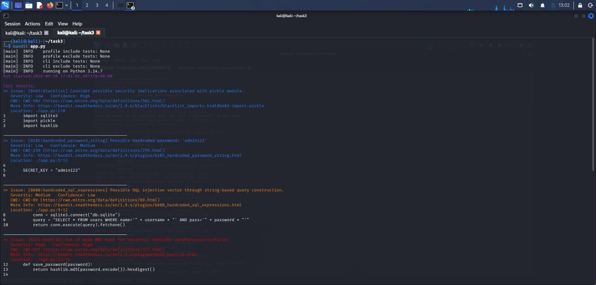

# CodeAlpha Secure Coding Review

## 1. Introduction
This project is a security audit of a simple Python login application (`app.py`). The goal is to find security vulnerabilities, document them, and fix them.

- **Language:** Python 3
- **Application:** Simple login system
- **Tools:** Bandit 1.9.4 (static analysis) + manual code review

## 2. Files
- `app.py` - vulnerable version of the code
- `app_fixed.py` - fixed, secure version
- `bandit_before.png` - Bandit scan of the vulnerable code
- `bandit_after.png` - Bandit scan of the fixed code

## 3. Findings

Bandit found 6 issues in `app.py` (1 High, 3 Medium, 2 Low).

| # | Bandit ID | Vulnerability | Line | Severity | CWE | Remediation |
|---|-----------|---------------|------|----------|-----|-------------|
| 1 | B324 | Weak MD5 hash | 13 | High | CWE-327 | Use bcrypt |
| 2 | B608 | SQL Injection | 9 | Medium | CWE-89 | Parameterized queries |
| 3 | B307 | Use of `eval()` | 16 | Medium | CWE-78 | Use `ast.literal_eval` |
| 4 | B301 | `pickle.loads` on untrusted data | 19 | Medium | CWE-502 | Use `json.loads` |
| 5 | B105 | Hardcoded secret | 5 | Low | CWE-259 | Use
